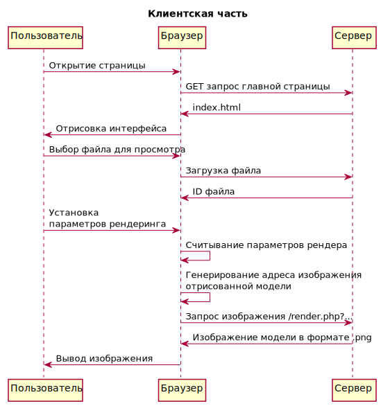
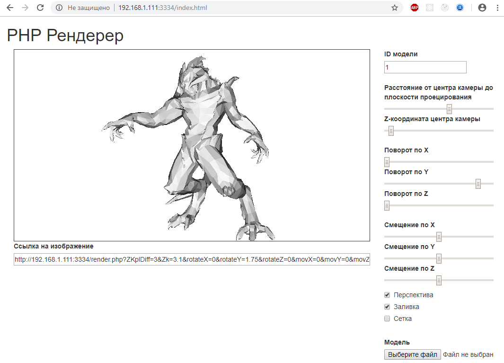

# Отчет по практике

Тема проекта: "Разработка web приложения для просмотра 3d моделей"

## Постановка задачи

Разработать клиент-серверное web-приложение, позволяющее отрисовывать 3d модели, сохраненные в формате .obj, с возможностью поворота и масштабирования. Сервер должен быть разработан на языке PHP, клиентская часть на JavaScript.

## Проектирование

Т.к. приложение клиент-серверное, рендеринг необходимо производить на серверной стороне. Для этого модель надо загрузить на сервер. Чтобы не выдавать пользователю название загруженного файла (для безопасности, на случай, если ему удасться загрузить вредоносный php скрипт), необходимо записать название файла в базу данных, а пользователю выдать ID записи. Для рендеринг изображения на лету, необходимо сделать php скрипт, принимающий GET запросы с параметрами рендеринга и отвечающий отрисованным изображением. Адрес GET запроса можно использовать как адрес картинки в html коде. Меняя адрес картинки можно менять параметры отрисовки модели. В клиентской части необходимо сделать поля для ввода параметров, из которых будет генерироваться адрес картинки.

Всю функциональность можно представить на диаграммах последовательностей

## Распределение задач между участниками

**Модестов Максим**

* PHP библиотека рендеринга моделей
* Парсинг файлов формата .OBJ
* Применение к модели трансформации
  * Поворот
  * Перемещение
  * Перспективное искажение
* Отрисовка каркасной сетки модели
* Отрисовка поверхностей модели

**Лапин Дмитрий**

* Создание базы данных, содержащей названия загруженных 3d моделей
* PHP скрипт, загружающий 3d файл и сохраняющий в базе данных запись о нем
* PHP скрипт, который запускает рендеринг модели с использованием переданных ему GET параметров
* HTML + JavaScript страница с интерфейсом, позволяющим загружать модель, устанавливать параметры отрисовки модели и просматривать её.

## Результаты

Было создано приложение, позволяющее просматривать 3d модели в формате .obj и вставлять изображения на сторонние сайты.

### Тестирование

Условия тестирования:

* **Сервер**:
  * **Процессор**: Intel(R) Core(TM) i5 CPU 760 @ 2.80GHz, 8 GB RAM
  * **PHP**: 5.6
  * **Mysql**: 5.5
* **Файл**:
  * **Вершин**: 2519
  * **Поверхностей**: 5022
  * **Размер**: 418КБ
* **Разрешение изображения**: 751x404

**Результаты тестирования**

Скорость генерирования изображений - 8 изображений в секунду.

Скорость существенно меняется при изменении модели, разрешения и параметров.

## Вывод

Получившаяся система не отличается скоростью работы, однако она все равно позволяет с легкостью получить изображение 3d модели, а при добавлении кеширования ее вполне можно будет использовать в качестве сервиса по рендерингу 3d моделей.